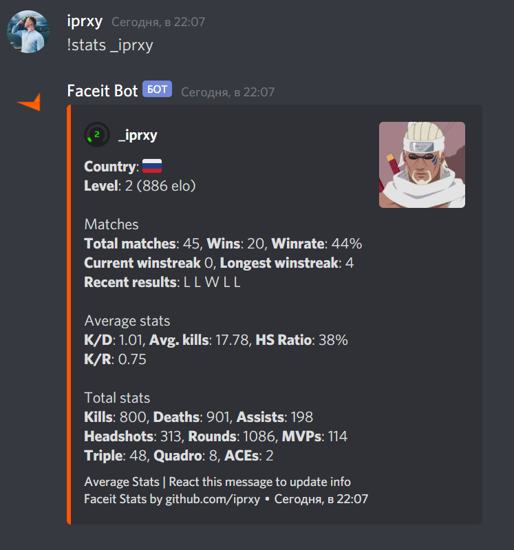
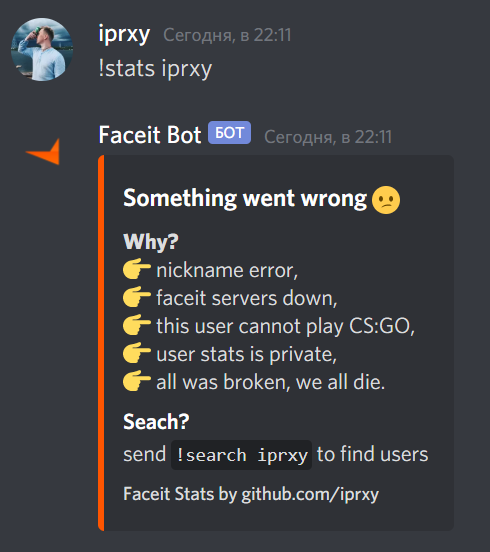
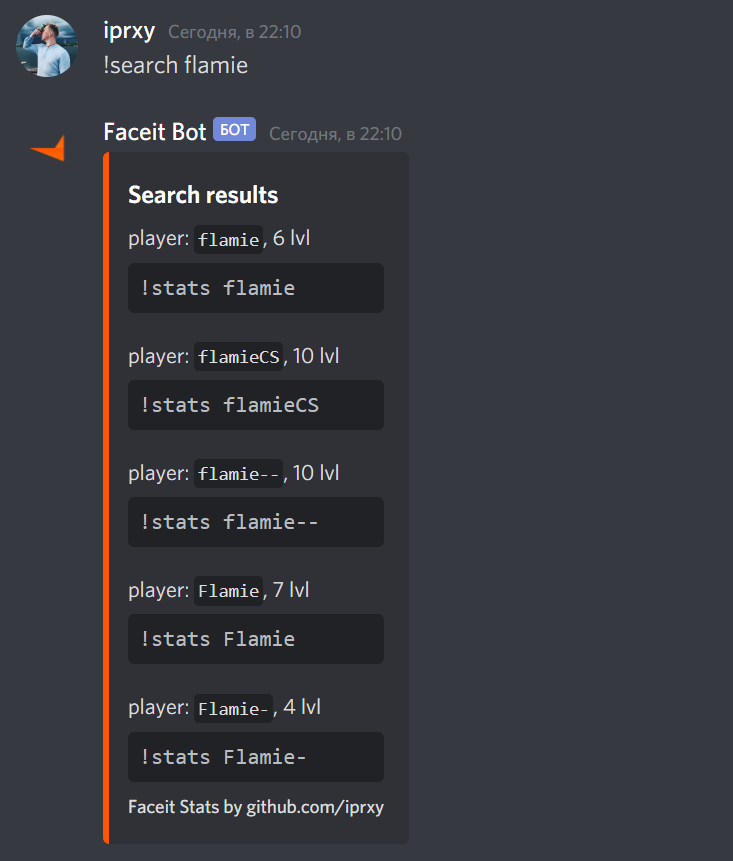

Note: tokens in commits are revoked 🤗

# discord-faceit-bot
Simple bot to get CS:GO stats from faceit.com [Add to Discord](https://discord.com/api/oauth2/authorize?client_id=765642102800646146&permissions=18432&scope=bot)  

## Available commands
### !stats {faceit nickname}
Command returns average CS:GO stats for a player:  

### !last20 {faceit nickname}
Comant returns average CS:GO stats for a last 20 player matches:

On error bot replies you:  

### !search {faceit nickname}
Command returns search results  

## Reaction message to update
Any reaction on message with stats updated message.  
You not need send different messages, just reaction on old message  

