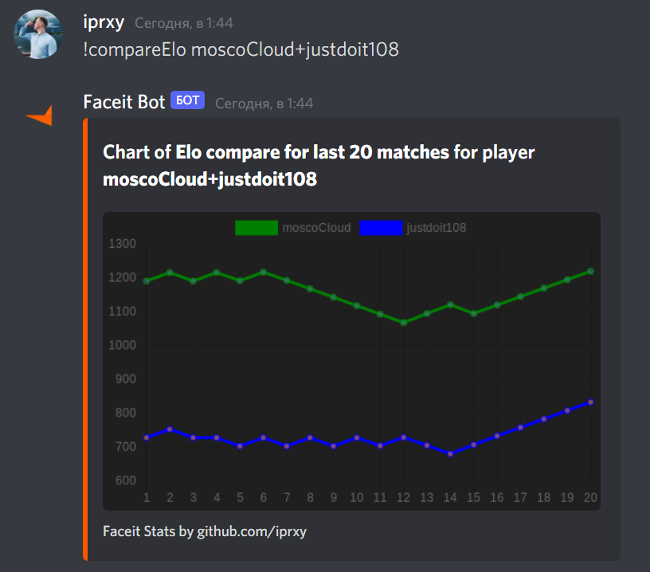

# discord-faceit-bot
Simple bot to get CS:GO stats from faceit.com [Add to Discord](https://discord.com/api/oauth2/authorize?client_id=765642102800646146&permissions=18432&scope=bot)  

## Available commands
### !stats nickname
Command returns average CS:GO stats for a player:  

### !last20 nickname
Command returns average CS:GO stats for a last 20 player matches:

### !find nickname1+nickname2
Command returns list of together matches between too players:

### !eloChart nickname
Command returns chart of elo for all matches (if matches count more 2000 command return only 2000):

### !last20Kills nickname
Command returns chart of kills count for last 20 matches:

### !compareKills nickname1+nickname2
Command returns compare chart with kills count for last 20 matches between 2 players:

### !compareElo nickname1+nickname2
Command returns compare chart with elo count for last 20 matches between 2 players:

On error bot replies you:  

### !search {faceit nickname}
Command returns search results  

## Reaction message to update
Any reaction on message with stats updated message.  
You not need send different messages, just reaction on old message  

